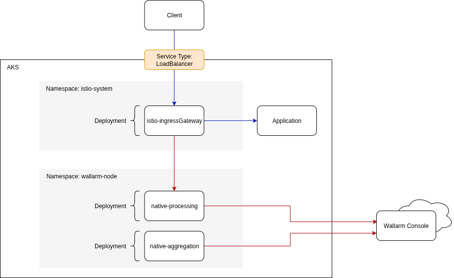
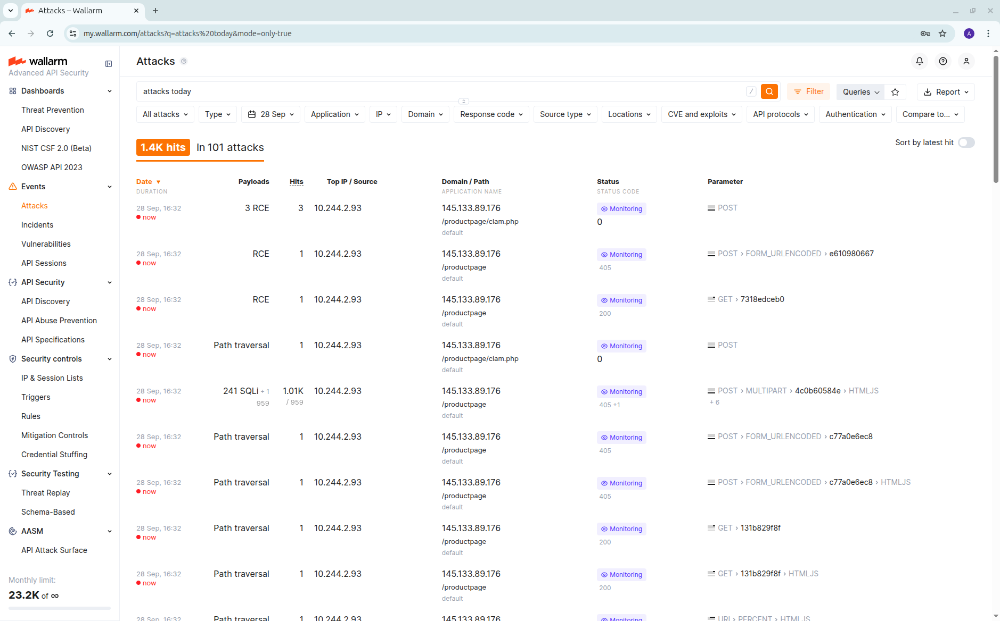

# Wallarm Connector
## Install the infrastructure
### Hosting platform
#### Deploy AKS
[Reference](https://learn.microsoft.com/en-us/azure/aks/learn/quick-kubernetes-deploy-cli)

```sh
# Initial configuration
REGION=uksouth
CLUSTER_NAME="ams-${RANDOM}"

# Resource Group creation
az group create --name "${CLUSTER_NAME}-rg"  --location $REGION

# AKS creation
az aks create \
  -g "${CLUSTER_NAME}-rg" \
  -n ${CLUSTER_NAME} \
  --enable-managed-identity \
  --node-count 3 \
  --zones 1 2 3 \
  --node-vm-size Standard_DS3_v2 \
  --generate-ssh-keys \
  --tier standard \
  --enable-cost-analysis

# Collect and merge credentials

# Verify
kubectl get node
#NAME                                STATUS   ROLES    AGE     VERSION
#aks-nodepool1-22535197-vmss000000   Ready    <none>   3m6s    v1.32.7
#aks-nodepool1-22535197-vmss000001   Ready    <none>   2m56s   v1.32.7
#aks-nodepool1-22535197-vmss000002   Ready    <none>   2m57s   v1.32.7
```

### Supporting Services

#### Install cert-manager
> This is not a specific requirement but is and optional requirement when we come to create the Node

[Reference](https://cert-manager.io/docs/installation/)

1. Install cert-manager itself
```sh
kubectl apply -f \
  https://github.com/cert-manager/cert-manager/releases/download/v1.18.2/cert-manager.yaml

# Verification
kubectl get pod -n cert-manager
#NAME                                       READY   STATUS    RESTARTS   AGE
#cert-manager-69f748766f-488sp              1/1     Running   0          111s
#cert-manager-cainjector-7cf6557c49-427mf   1/1     Running   0          112s
#cert-manager-webhook-58f4cff74d-k85sc      1/1     Running   0          111s
```

2. Now create a self signed ClusterIssuer
```sh
cat <<EOF | kubectl apply -f -
apiVersion: cert-manager.io/v1
kind: ClusterIssuer
metadata:
  name: selfsigned-issuer
spec:
  selfSigned: {}
---
apiVersion: cert-manager.io/v1
kind: Certificate
metadata:
  name: my-selfsigned-ca
  namespace: cert-manager
spec:
  isCA: true
  commonName: my-selfsigned-ca
  secretName: root-secret
  privateKey:
    algorithm: ECDSA
    size: 256
  issuerRef:
    name: selfsigned-issuer
    kind: ClusterIssuer
    group: cert-manager.io
---
apiVersion: cert-manager.io/v1
kind: ClusterIssuer
metadata:
  name: my-ca-issuer
spec:
  ca:
    secretName: root-secret
EOF
```
#### Install istio
[Reference](https://istio.io/latest/docs/setup/install/istioctl/)

```sh
# Download the latest binary
curl -L https://istio.io/downloadIstio | sh -
export ISTIOCTL="$(ls -d istio-*)/bin/istioctl"

# And install
$ISTIOCTL install --set meshConfig.accessLogFile=/dev/stdout -y

# Verification
kubectl get pod -n istio-system
#NAME                                   READY   STATUS    RESTARTS   AGE
#istio-ingressgateway-b6cd68585-v2msw   1/1     Running   0          7s
#istiod-7d4f74889d-jzc7b                1/1     Running   0          15s
```

> **INFO** The patch below will enable preserving the true client IP. Without it we would see the local IP address of the external load balancer in the logs
```sh
kubectl patch svc istio-ingressgateway -n istio-system \
  -p '{"spec":{"externalTrafficPolicy":"Local"}}'
```
#### Deploy a sample application

1. We install the application and verify locally
```sh
# Create and label the namespace
kubectl create namespace bookinfo
kubectl label namespace bookinfo istio-injection=enabled

# Deploy the application
kubectl apply -n bookinfo \
  -f https://raw.githubusercontent.com/istio/istio/release-1.27/samples/bookinfo/platform/kube/bookinfo.yaml

# Verification
kubectl exec -n bookinfo \
  "$(kubectl get pod -n bookinfo -l app=ratings \
  -o jsonpath='{.items[0].metadata.name}')" \
  -c ratings \
  -- curl -sS productpage:9080/productpage | grep -o "<title>.*</title>"
#<title>Simple Bookstore App</title>
```

2. We create an ingress configuration and test it
```sh
# Create the gateway resources
kubectl apply -n bookinfo \
-f https://raw.githubusercontent.com/istio/istio/refs/heads/master/samples/bookinfo/networking/bookinfo-gateway.yaml

# Find and store the gateway address
export GWY_IP=$(kubectl get svc \
  -n istio-system istio-ingressgateway \
  -o jsonpath='{.status.loadBalancer.ingress[0].ip}')

#Verification
curl -s $GWY_IP/productpage | grep -o "<title>.*</title>"
#<title>Simple Bookstore App</title>

```

## Connector Installation

### Deploy the Native Node

Create and collect the Node token

Configure the Helm values and install a release

> **NOTE** The documentation discusses valid, signed certificates. In this walk thorough we will provide self signed certificates for the Wallarm Node and skip verification of the TLS connection in the Istio configuration. This is not recommended for production.

> **WARNING** The documentation is not correct here. It mentions creating the Helm values file but then does not include that file in the example. 

```sh
# Export the TOKEN collected from the Wallarm Console
export WALLARM_API_TOKEN=****

# Create the values for the release
cat <<EOF > native_node.values
config:
  connector:
    mode: envoy-external-filter
    certificate:
      enabled: true
      certManager:
        enabled: true
        issuerRef:
          name: my-ca-issuer
          kind: ClusterIssuer
processing:
  service:
    type: ClusterIP
EOF

# Install the release
helm upgrade --install --version 0.18.0 \
  node wallarm/wallarm-node-native \
  -n wallarm-node \
  --create-namespace \
  --set config.api.token=${WALLARM_API_TOKEN} \
  --set config.api.host=api.wallarm.com \
  --values native_node.values
```

> **INFO** At the point the node appears to have registered via the **Wallarm Console -> Nodes** view

### Configure the Envoy Gateway

Notes regarding the documentation at this point:
1. There is mention of updating the config file `envoy.yaml` without guidance on how this should be achieved.
2. It is not clear until later in the document that it is the Istio Gateway that should be configured. The default would be to apply this configuration to the sidecars.

I will attempt the following:
1. Use the recommended Istio methods to amend the configuration.
2. Apply this configuration to a default provided `istio-ingressgateway`
3. As per the note above, I will skip verification of the Node presented certificate.



1. We need to patch the load balancer to see the true client IP address. Without this step we would only see the private load balancer address.
```sh
kubectl patch svc istio-ingressgateway -n istio-system \
  -p '{"spec":{"externalTrafficPolicy":"Local"}}'
```

2.  Add the `external_processor` HTTP filter. This is achieved by creating an EnvoyFilter. Notice the cluster_name. As we have already installed the the node into this istio mesh, the cluster will already existed thanks the the automatic service discovery. [EnvoyFilter](https://istio.io/latest/docs/reference/config/networking/envoy-filter/)
```sh
cat <<EOF | kubectl apply -n istio-system -f -
apiVersion: networking.istio.io/v1alpha3
kind: EnvoyFilter
metadata:
  name: wallarm-ext-proc
spec:
  workloadSelector:
    labels:
      istio: ingressgateway
  configPatches:
  - applyTo: HTTP_FILTER
    match:
      context: GATEWAY
      listener:
        filterChain:
          filter:
            name: "envoy.filters.network.http_connection_manager"
            subFilter:
              name: "envoy.filters.http.router"
    patch:
      operation: INSERT_BEFORE
      value:
        name: envoy.filters.http.ext_proc
        typed_config:
          "@type": type.googleapis.com/envoy.extensions.filters.http.ext_proc.v3.ExternalProcessor
          grpc_service:
            envoy_grpc:
              cluster_name: outbound|5000||native-processing.wallarm-node.svc.cluster.local
          processing_mode:
            request_body_mode: STREAMED
            response_body_mode: STREAMED
          request_attributes: ["request.id", "request.time", "source.address"]
EOF
```

> **TROUBLESHOOTING** To ensure the filter has been correctly applied we can directly view the resultant Envoy configuration for the ingress gateway
> ```sh
> $ISTIOCTL pc all \
>   -n istio-system deploy/istio-ingressgateway \
>   -o yaml \
>   | grep -A10 type.googleapis.com/envoy.extensions.filters.http.ext_proc.v3.ExternalProcessor
>   ```

3. Once we have defined the filter above we should configure the cluster associated with the Wallarm processing node [DestinationRule](https://istio.io/latest/docs/reference/config/networking/destination-rule/)
```sh
cat <<EOF | kubectl apply -n istio-system -f -
apiVersion: networking.istio.io/v1
kind: DestinationRule
metadata:
  name: wallarm-node-tls
spec:
  host: native-processing.wallarm-node.svc.cluster.local
  trafficPolicy:
    portLevelSettings:
    - port:
        number: 5000
      tls:
        mode: SIMPLE
        insecureSkipVerify: true
    loadBalancer:
      simple: LEAST_REQUEST
EOF
```

4. The documentation suggests that the configuration is now complete, lets test
```sh
curl -s $GWY_IP/productpage -v | grep -o "<title>.*</title>"
```
```text
*   Trying 145.133.89.176:80...
* Connected to 145.133.89.176 (145.133.89.176) port 80
> GET /productpage HTTP/1.1
> Host: 145.133.89.176
> User-Agent: curl/8.5.0
> Accept: */*
> 
< HTTP/1.1 500 Internal Server Error
< date: Sun, 28 Sep 2025 14:47:58 GMT
< server: istio-envoy
< content-length: 0
< 
* Connection #0 to host 145.133.89.176 left intact
```

> **TROUBLESHOOTING** We now have a broken ingress gateway. The documentation mentioned how to avoid the 500 errors but this suggests that that we ignore the configuration we have just put in place.

1. What does the gateway think is the issue
```sh
kubectl logs -n istio-system istio-ingressgateway-57d847db79-fcp8k --tail 1
```
```text
[2025-09-28T14:47:58.720Z] "GET /productpage HTTP/1.1" 500 - ext_proc_error_gRPC_error_14{upstream_connect_error_or_disconnect/reset_before_headers._reset_reason:_protocol_error{upstream_reset_before_response_started{protocol_error}}} - "-" 0 0 6 - "51.7.87.133" "curl/8.5.0" "b76949de-a72a-4f9a-a11b-0516bd2b1ea9" "145.133.89.176" "-" outbound|9080||productpage.bookinfo.svc.cluster.local - 10.244.2.31:8080 51.7.87.133:40772 - -
```

2. `_protocol_error` with the ext_proc service, lets look at our cluster configuration. We are looking here as this is the component that defines the next hop for the ext_proc service
```sh
$ISTIOCTL pc cluster -n istio-system deploy/istio-ingressgateway --fqdn processing.wallarm -o yaml
```
```text
- altStatName: outbound|5000||native-processing.wallarm-node.svc.cluster.local;
  circuitBreakers:
    thresholds:
    - maxConnections: 4294967295
      maxPendingRequests: 4294967295
      maxRequests: 4294967295
      maxRetries: 4294967295
      trackRemaining: true
  commonLbConfig: {}
  connectTimeout: 10s
  edsClusterConfig:
    edsConfig:
      ads: {}
      initialFetchTimeout: 0s
      resourceApiVersion: V3
    serviceName: outbound|5000||native-processing.wallarm-node.svc.cluster.local
  filters:
  - name: istio.metadata_exchange
    typedConfig:
      '@type': type.googleapis.com/udpa.type.v1.TypedStruct
      typeUrl: type.googleapis.com/envoy.tcp.metadataexchange.config.MetadataExchange
      value:
        enable_discovery: true
        protocol: istio-peer-exchange
  lbPolicy: LEAST_REQUEST
  metadata:
    filterMetadata:
      istio:
        alpn_override: "false"
        config: /apis/networking.istio.io/v1/namespaces/istio-system/destination-rule/wallarm-node-tls
        services:
        - host: native-processing.wallarm-node.svc.cluster.local
          name: native-processing
          namespace: wallarm-node
  name: outbound|5000||native-processing.wallarm-node.svc.cluster.local
  transportSocket:
    name: envoy.transport_sockets.tls
    typedConfig:
      '@type': type.googleapis.com/envoy.extensions.transport_sockets.tls.v3.UpstreamTlsContext
      commonTlsContext:
        tlsParams:
          tlsMaximumProtocolVersion: TLSv1_3
          tlsMinimumProtocolVersion: TLSv1_2
        validationContext: {}
  type: EDS
  typedExtensionProtocolOptions:
    envoy.extensions.upstreams.http.v3.HttpProtocolOptions:
      '@type': type.googleapis.com/envoy.extensions.upstreams.http.v3.HttpProtocolOptions
      explicitHttpConfig:
        httpProtocolOptions: {}
      upstreamHttpProtocolOptions:
        autoSni: true

```

3. We can see from the above that we are not validating any certificates for the specific `port_ 5000` What else?
4. If we look at the documentation we can see the explicit mention of `http2` protocol, we are having protocol errors. We can see from the above cluster configuration that there is no explicit http2 configuration. This line is mentioned in the documentation
```text
http2_protocol_options: {} # must be set for enabling http2
```

5. The Istio documentation [explicit protocol selection](https://istio.io/latest/docs/ops/configuration/traffic-management/protocol-selection/#explicit-protocol-selection) explains how this should be automatically defined as part of the service definition, lets look
```sh
kubectl get service -n wallarm-node native-processing \
  -o jsonpath='{.spec.ports}' | jq .
```
```text
[
  {
    "name": "node",
    "port": 5000,
    "protocol": "TCP",
    "targetPort": "node"
  }
]
```

6. Nothing there... Lets set it up. I do not want to change the port name as this may be used elsewhere.
```sh
kubectl patch svc -n wallarm-node native-processing -p '{"spec":{"ports": [{"port": 5000, "appProtocol":"GRPC"}]}}'
```
```text
service/native-processing patched
```

7. Check the configuration
```sh
$ISTIOCTL pc cluster -n istio-system deploy/istio-ingressgateway --fqdn processing.wallarm -o yaml | grep http2
```
```text
        http2ProtocolOptions: {}
```

8. And test
```sh
curl -s $GWY_IP/productpage -v | grep -o "<title>.*</title>"
```
```text
*   Trying 145.133.89.176:80...
* Connected to 145.133.89.176 (145.133.89.176) port 80
> GET /productpage HTTP/1.1
> Host: 145.133.89.176
> User-Agent: curl/8.5.0
> Accept: */*
> 
< HTTP/1.1 200 OK
< server: istio-envoy
< date: Sun, 28 Sep 2025 15:09:47 GMT
< content-type: text/html; charset=utf-8
< vary: Cookie
< x-envoy-upstream-service-time: 121
< transfer-encoding: chunked
< 
{ [1239 bytes data]
* Connection #0 to host 145.133.89.176 left intact
<title>Simple Bookstore App</title>
```

9. Success!

## Test the Installation
### Install `gotestwaf`
```sh
kubectl create namespace gotestwaf

cat << EOF | kubectl apply -n gotestwaf -f -
apiVersion: v1
kind: PersistentVolumeClaim
metadata:
  name: gotestwaf
spec:
  accessModes:
    - ReadWriteOnce
  resources:
    requests:
      storage: 3Gi
---
apiVersion: apps/v1
kind: Deployment
metadata:
  labels:
    app: gotestwaf
  name: gotestwaf
spec:
  replicas: 1
  selector:
    matchLabels:
      app: gotestwaf
  template:
    metadata:
      labels:
        app: gotestwaf
    spec:
      securityContext:
        runAsUser: 0
      containers:
      - image: wallarm/gotestwaf:latest
        name: gotestwaf
        resources: {}
        args:
        - --url=http://${GWY_IP}/productpage
        - --noEmailReport
        volumeMounts:
        - mountPath: "/app/reports"
          name: reports
      volumes:
      - name: reports
        persistentVolumeClaim:
          claimName: gotestwaf
EOF
```

> **TROUBLESHOOTING** The `gotestwaf` pod is in Error state

1. Lets look at the pod logs
```sh
kubectl logs -n gotestwaf gotestwaf-5c6f64db8b-trbhg 
```
```text
time="2025-09-28T15:17:36Z" level=info msg="GoTestWAF started" version=v0.5.8
time="2025-09-28T15:17:36Z" level=info msg="Test cases loading started"
time="2025-09-28T15:17:36Z" level=info msg="Test cases loading finished"
time="2025-09-28T15:17:36Z" level=info msg="Test cases fingerprint" fp=c6d14d6138601d19d215bb97806bcda3
time="2025-09-28T15:17:36Z" level=info msg="Try to identify WAF solution"
time="2025-09-28T15:17:36Z" level=info msg="WAF was not identified"
time="2025-09-28T15:17:36Z" level=info msg="gohttp is used as an HTTP client to make requests" http_client=gohttp
time="2025-09-28T15:17:36Z" level=info msg="WAF pre-check" url="http://145.133.89.176/productpage"
time="2025-09-28T15:17:36Z" level=error msg="caught error in main function" error="WAF was not detected. Please use the '--blockStatusCodes' or '--blockRegex' flags. Use '--help' for additional info. Baseline attack status code: 200"
```

2. It mentions the argument `--blockStatusCodes`. The istio connector documentation mentions there is a limitation
```text
All [blocked](https://docs.wallarm.com/admin-en/configure-wallarm-mode/) malicious traffic is returned with status code `403` and the default block page.
```

3. Lets try it, no still broken!
```sh
kubectl -n gotestwaf patch deployment gotestwaf \
--type=json \
-p='[{"op": "add", "path": "/spec/template/spec/containers/0/args/-", "value": "--blockStatusCodes=403"}]'
kubectl scale -n gotestwaf deploy/gotestwaf --replicas 0
kubectl scale -n gotestwaf deploy/gotestwaf --replicas 1
#kubectl get pods -n gotestwaf
#NAME                       READY   STATUS             RESTARTS     AGE
#gotestwaf-974d76fb-md8zt   0/1     CrashLoopBackOff   1 (3s ago)   6s
```
> **NOTE** We have to scale down then back up as we have a single use PVC. If we roll out a restart the old pod would wait on the new one being available but would be blocking the new pod as it still had the PVC claim bound.

4. There is no blocking at the moment so nothing to check, sledgehammer time!
```sh
kubectl -n gotestwaf patch deployment gotestwaf \
--type=json \
-p='[{"op": "add", "path": "/spec/template/spec/containers/0/args/-", "value": "--skipWAFBlockCheck"}]'
```

5. Excellent!
```sh
kubectl get pods -n gotestwaf
#NAME                         READY   STATUS    RESTARTS   AGE
#gotestwaf-59c4956f54-2ffrs   1/1     Running   0          3s
kubectl logs -n gotestwaf gotestwaf-59c4956f54-2ffrs
```
```text
time="2025-09-28T15:32:18Z" level=info msg="GoTestWAF started" version=v0.5.8
time="2025-09-28T15:32:18Z" level=info msg="Test cases loading started"
time="2025-09-28T15:32:18Z" level=info msg="Test cases loading finished"
time="2025-09-28T15:32:18Z" level=info msg="Test cases fingerprint" fp=c6d14d6138601d19d215bb97806bcda3
time="2025-09-28T15:32:18Z" level=info msg="Try to identify WAF solution"
time="2025-09-28T15:32:18Z" level=info msg="WAF was not identified"
time="2025-09-28T15:32:18Z" level=info msg="gohttp is used as an HTTP client to make requests" http_client=gohttp
time="2025-09-28T15:32:18Z" level=info msg="WAF pre-check" status=skipped
time="2025-09-28T15:32:18Z" level=info msg="gRPC pre-check" status=started
time="2025-09-28T15:32:18Z" level=info msg="gRPC pre-check" connection="not available" status=done
time="2025-09-28T15:32:18Z" level=info msg="GraphQL pre-check" status=started
time="2025-09-28T15:32:18Z" level=info msg="GraphQL pre-check" connection="not available" status=done
time="2025-09-28T15:32:18Z" level=info msg="Scanning started" url="http://145.133.89.176/productpage"
```

### Verification

The documentation mentions viewing the **Wallarm Console -> Attacks** section


`gotestwaf` also produces a report
```sh
kubectl logs -n gotestwaf gotestwaf-59c4956f54-2ffrs --tail 1
#time="2025-09-28T15:37:47Z" level=info msg="Export PDF full report" filename=reports/waf-evaluation-report-2025-September-28-15-37-45.pdf

kubectl cp \
  -n gotestwaf \
  gotestwaf-59c4956f54-2ffrs:reports/waf-evaluation-report-2025-September-28-15-37-45.pdf \
  ./report.pdf
```


## Appendium

I scanned some of the images from some of the Helm charts and found several Critical and High level vulnerabilities. These would not be allowed within the financial institutions I work in.


